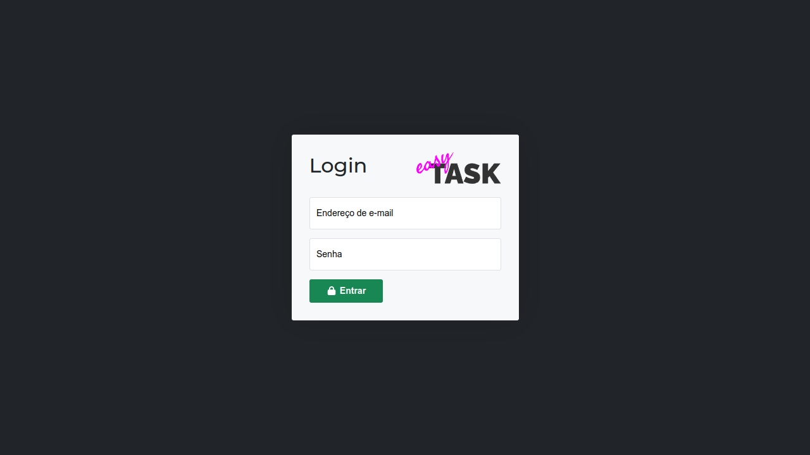
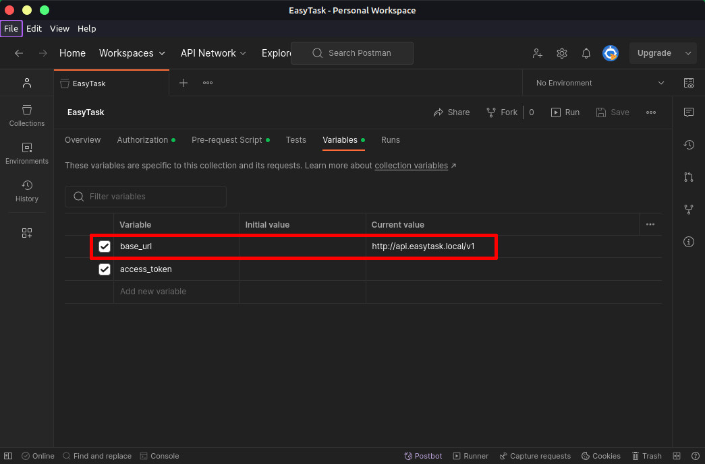

# EasyTask API
## Gerenciador de Projetos de Tarefas

### Introdução
EasyTask é um gerenciador de projetos e tarefas, com suporte a gestão de usuários, atribuição de responsáveis gerenciais à projetos e atribuição de responsáveis operacionais à tarefas. Simples, direto ao ponto, responsivo, visa atender as mais diversas necessidades de gestão de demandas.

### Instalação - API

#### Ambiente Local
Para executar o EasyTask API em ambiente local, siga os passos abaixo:
1. Crie um arquivo `.env` na raiz do projeto, utilizando como referência o arquivo `.env.example` disponível no repositório.
2. No arquivo `.env` criado, defina as propriedades abaixo, conforme informado:

|Propriedade|Descrição|
|--|--|
|APP_NAME|Nome da aplicação|
|APP_URL|URL da aplicação (API)|
|DB_CONNECTION|Tipo de conexão com banco de dados|
|DB_HOST|Host do banco de dados|
|DB_PORT|Porta do banco de dados|
|DB_DATABASE|Nome do banco de dados|
|DB_USERNAME|Usuário para acessar o banco de dados|
|DB_PASSWORD|Senha do usuário para acessar o banco de dados|

3. Execute o comando `composer install` para instalar todas as dependências da aplicação.
4. Execute o comando `php artisan jwt:secret` para gerar a chave de segurança dos mecanismos de autenticação JWT.
5. Execute o comando `php artisan storage:link` para preparar o link simbólico de armazenamento de arquivos.
6. Execute o comando `php artisan migrate` para que seja construído o banco de dados. **Opcional:** Inclua a flag `--seed` para que seja adicionado no banco o usuário padrão.
7. Configure o seu servidor local para servir os conteúdos da aplicação a partir do diretório `/public`. Normalmente, em ambientes com servidor Apache, isso é feito com VirtualHosts. Verifique a documentação da aplicação que estiver utilizando para mais informações.

#### Ambiente hospedado (servidor)
Para hospedar o EasyTask API em um servidor online, é recomendado utilizar o servidor Apache. Normalmente, hospedagens compartilhadas utilizam essa aplicação para servir seus conteúdos. É importante Atendendo a esse requisito, siga os passos abaixo:
1. Siga os passos em **Ambiente Local** para preparar a aplicação.
2. Faça o upload **de todos os arquivos** para seu servidor de hospedagem. É importante verificar se sua hospedagem suporta servir o conteúdo a partir do diretório `/public`. Caso contrário, a aplicação poderá não funcionar como esperado.
3. Lembre-se de editar o arquivo `.env` para informar as propriedades, agora de acordo com seu servidor de hospedagem.

#### Testes
Disponível neste repositório, há uma [collection](EasyTask.postman_collection.json) para a aplicação [Postman](https://www.postman.com/), que pode ser utilizada para entender os endpoints da aplicação e realizar os testes.

##### Notas Importantes sobre os Testes
- Ao importar a collection no seu Postman, vá até a aba *Variables* e altere a variável `base_url` para a URL correspondente à API que você configurou, podendo ser em ambiente local ou em ambiente hospedado. Assim, a aplicação funcionará normalmente.

- Mantenha a variável `access_token` vazia após a importação da collection, pois ela é automaticamente preenchida e atualizada quando você executa os endpoints de Login, Logout e Refresh Token.
- Para iniciar os testes, é importante executar o endpoint de Login. Assim, será gerado o `access_token` para sua sessão, que será armazenado na variável de mesmo nome dentro do Postman e utilizado em todas as requisições subsequentes.
- Se, durante seus testes, os endpoints retornarem erro de autenticação 401, execute o endpoint Refresh Token, assim seu `access_token` será atualizado e você poderá continuar os testes.

### Créditos
Toda a aplicação EasyTask API foi desenvolvida por Raphael B. Fontão, e está disponível com seu código-fonte no GitHub, em [https://github.com/rbfraphael/easytask-api](https://github.com/rbfraphael/easytask-api). Sua redistribuição, modificação e demais alterações são permitidas sem a necessidade de atribuição de créditos ou direitos autorais.